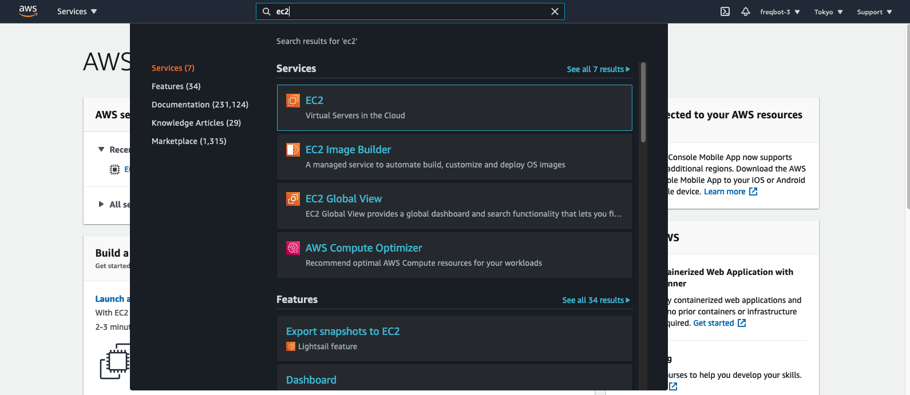
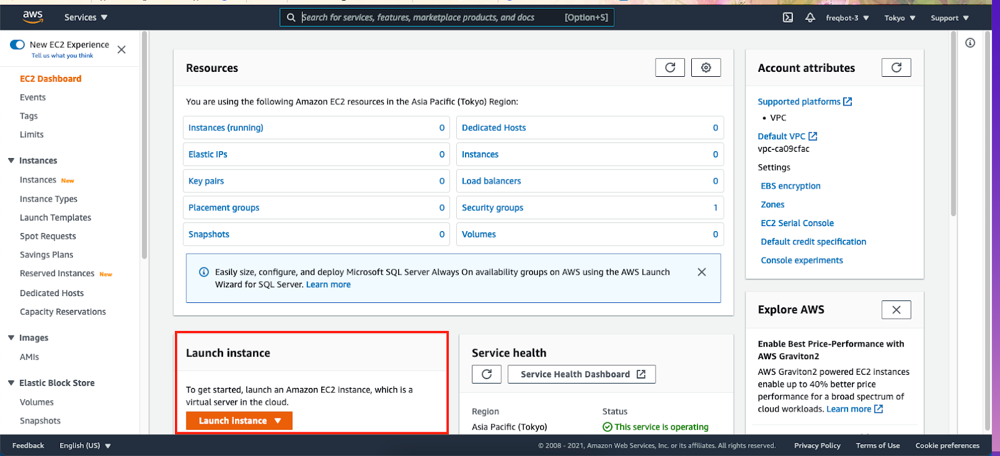
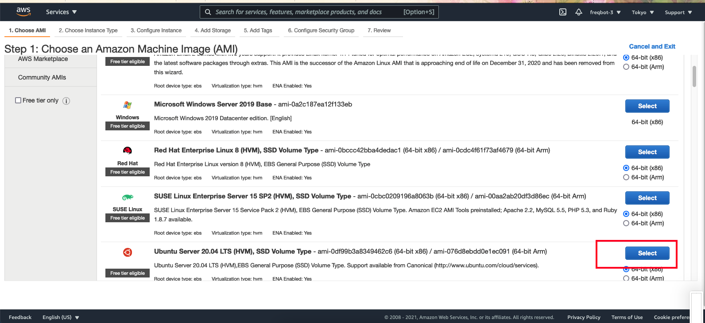
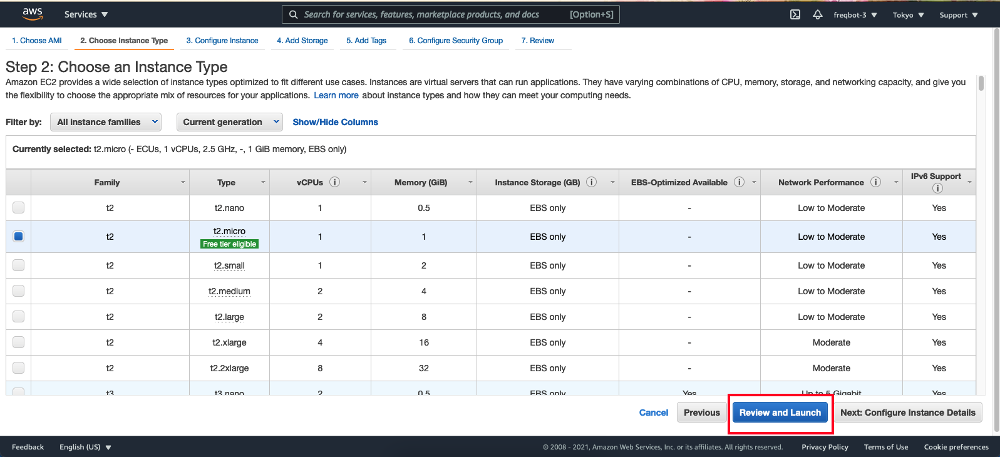
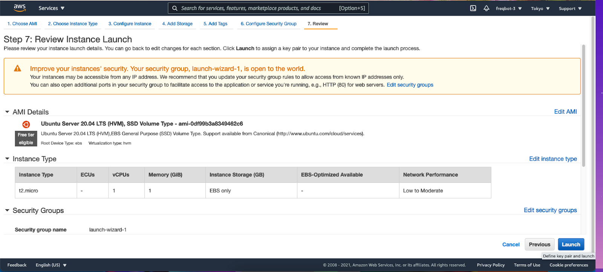
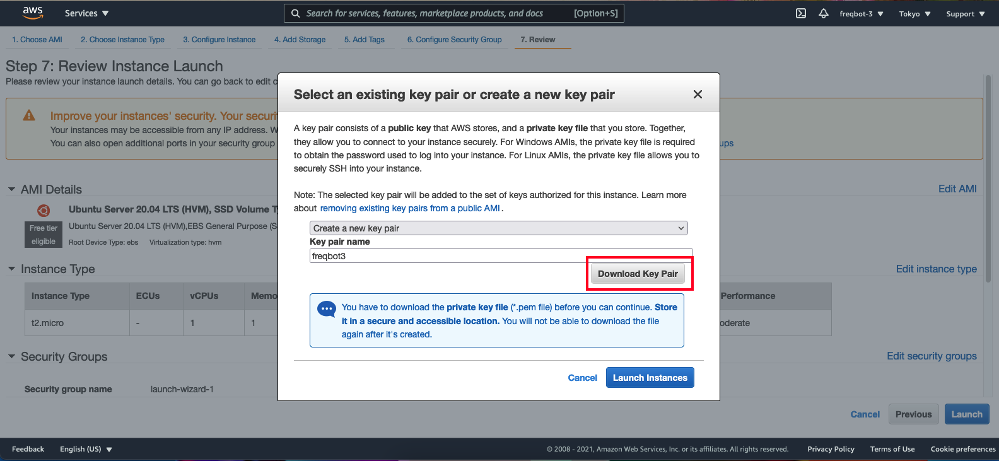
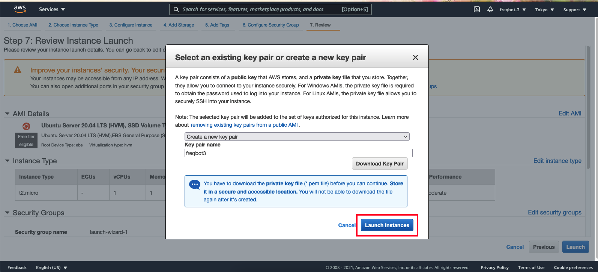
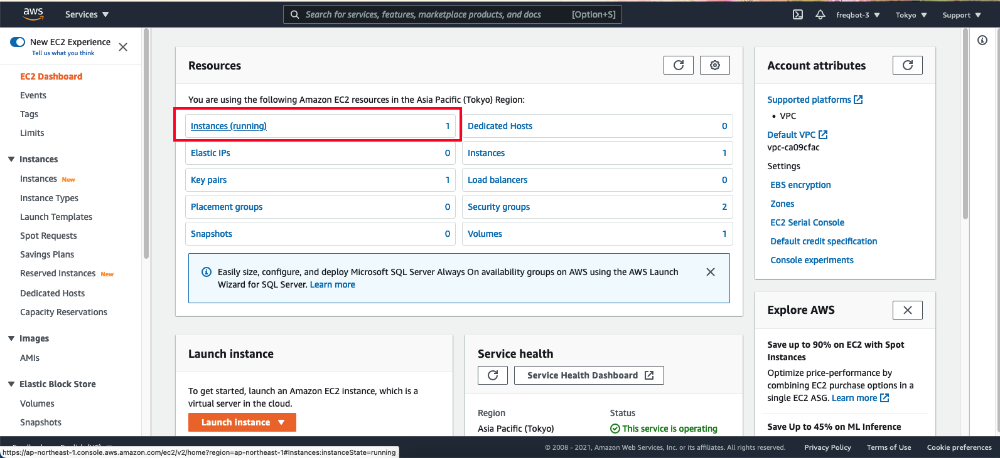
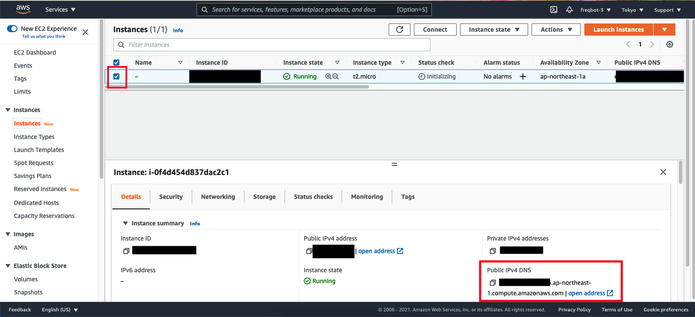
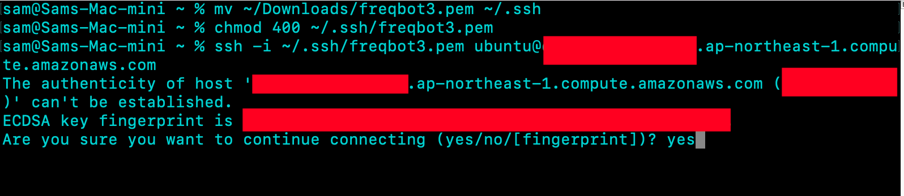

# Freqtrade EC2 Instructions

### 1. [Create an account on AWS](https://portal.aws.amazon.com/billing/signup#/start) (You get a 1 year free trial)

### 2. Search for EC2



### 3. Click Launch Instance
- Launches an EC2 VM (Virtual Machine)



### 4. Choose Ubuntu20



### 5. Select t2.micro

- It’s the one that works with a free trial 

### Click Review and Launch

##### Note

- You may have trouble installing ta-lib from the `setup.sh` script on a t2-micro, sometimes it works, sometimes it doesn't. You can try to non free-trail t2.small for better results.



### 6. Click Launch



### 7. Create a keypair (or use your own)




### 8. Search for EC2 again


### 9. View your instances



### 10. With your instance selected, copy the Public IPv4 DNS
- it changes about everyday, so if you need to ssh into this VM again, you have to login and check the ip again, or you can
[allocate an elastic ip](https://docs.aws.amazon.com/AWSEC2/latest/UserGuide/elastic-ip-addresses-eip.html#using-instance-addressing-eips-allocating), and [associate it to the VM](https://docs.aws.amazon.com/AWSEC2/latest/UserGuide/elastic-ip-addresses-eip.html#using-instance-addressing-eips-associating)



### 11. Move your ssh key to ~/.ssh and change it’s permissions to 400. (Mac and Linux Operating Systems)
Now you’re able to login to the VM you just created

```
mv ~/Downloads/freqbot.pem ~/.ssh
chmod 400 ~/.ssh/freqbot.pem
ssh -i ~/.ssh/freqbot.pem ubuntu@your_ip.compute.amazonaws.com
```



### 12.a (Optionl, kinda) You'll probably run into less problems if you use clang as your compiler and install TA-LIB with it instead of using gcc

```
sudo apt-get update
sudo apt-get install python3.9 screen clang python3-dev python3.9-dev <<< 'y'
sudo curl https://bootstrap.pypa.io/get-pip.py -o get-pip.py
sudo CC=clang python3.9 get-pip.py 
wget http://prdownloads.sourceforge.net/ta-lib/ta-lib-0.4.0-src.tar.gz
tar zxvf ta-lib-0.4.0-src.tar.gz
cd ta-lib && sed -i.bak "s|0.00000001|0.000000000000000001 |g" src/ta_func/ta_utility.h && ./configure && make && sudo make install && cd ..
sudo CC=clang LDSHARED="clang -shared" python3.9 -m pip install TA-LIB
```

### 12.b Your ec2 is all good now. You can run this to get freqtrade downloaded and configured
```
sudo apt-get update
sudo apt-get install python3.9
git clone https://github.com/freqtrade/freqtrade
cd ./freqtrade
./setup.sh -i
```

##### NOTE 
If your installation hangs on `Running setup.py install for TA-Lib ../` you can try
- Using a t2.small(not free-trial eligible) instead of a t2 micro
- using `clang` as a C compiler instead of `gcc`
- Deactivating your ec2 and setting up a new one
- Exiting your session and trying to install a different day (sometimes it just doesn't work)

### 13. Screen is a command that you can use to run programs as a background process
 
When you run a program using screen on virtual machine that you have connected to remotely (e.g. via ssh), you can close your connection, and the program will keep running. Run these commands to execute freqtrade using screen

```
sudo apt-get install screen
screen -dm freqtrade -s YourStrategy
```

Freqtrade is now running in the background and you can `exit` out of your connection, close your terminal, turn off your computer, and freqtrade will still be running. 

If you want to check the console output of your execution of freqtrade, you can reconnect to your VM and run `screen -r` to open your execution in the foreground. 

Once you are done checking it, press ctrl+d followed by ctrl+a to move the process back to the background
